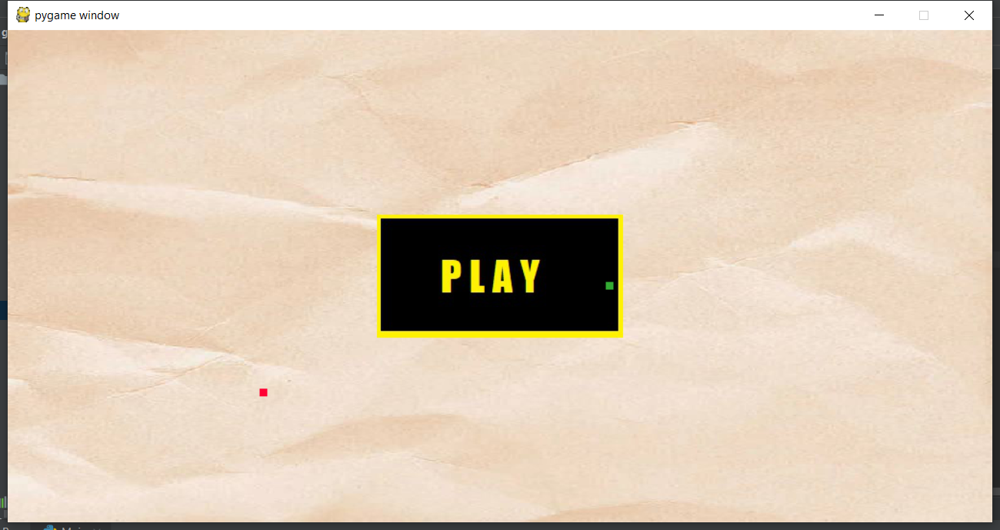
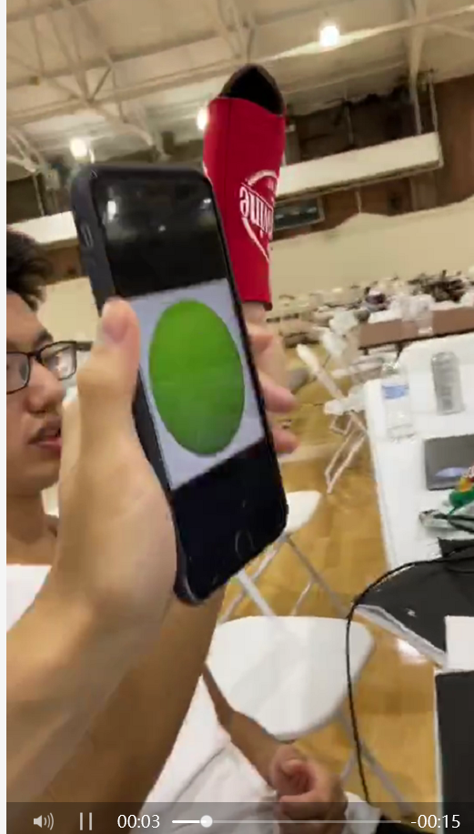
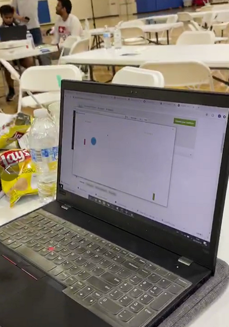
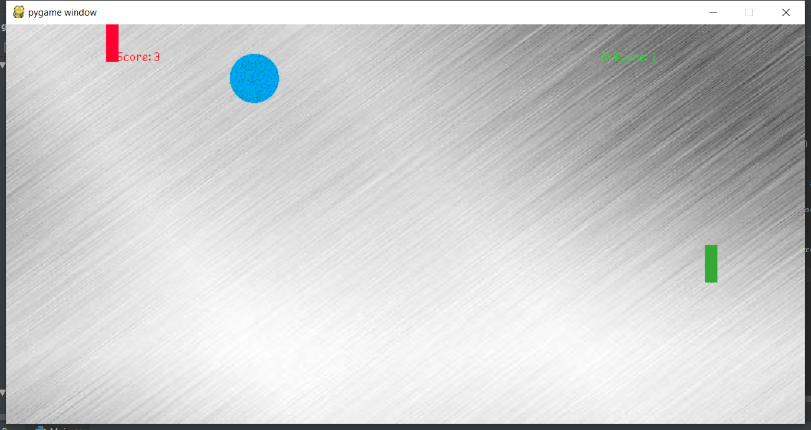

# Micro VR Hockey
This is a <b>Micro VR</b> motion game based on webcam and openCV.

## Getting started
This game is dedicated to help people in work space stretching body and relieving pressure. Using the webcam as the input source, the project enables people doing exercise in fun and with no cost! The combination of physics engine and webcam can be used in the future to create more micro VR games like this
 
The game requires two gloves / objects, one red and the other green (You can even play with your lips!!!).. The a.mp4 is a video demo.

### Pre-requieites
Python, openCV, PyGame requried.
 
<b>Also be sure to turn your webcam on !!!!!</b>

### How to use
Download the files and run python main.py. Use the two objects (red and green) as moving walls to play the table hockey.
   

 

## Authors
Leo Chan, Daniel Huang, Harry Liu, Vicent Chen - Students at UNC-Chapel Hill, USA
 
(Jingyuan Chen, Tenghao Huang, Yufan Liu, Zihong Chen)

## Disclaimer
This project is for demonstrative purpose only. Any replication of it should be restricted to non-commercial uses only.   
All files, images, models are created either by the authors or from free / opensourced materials on the internet.   
